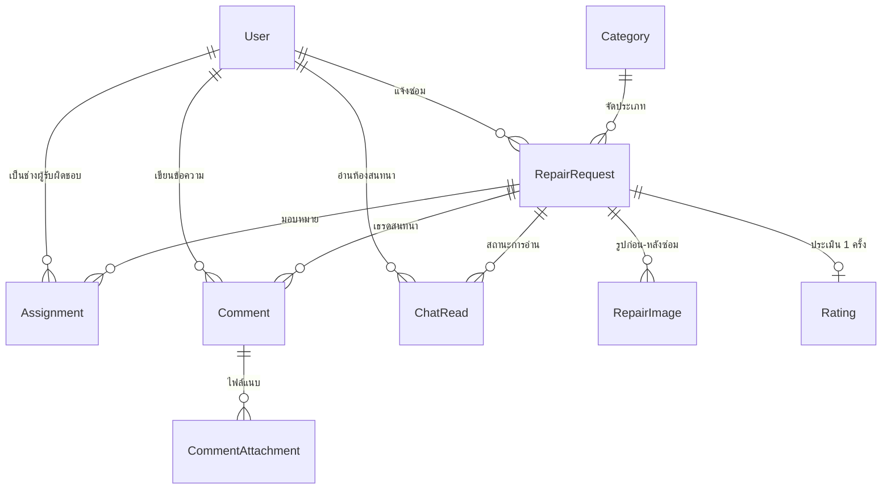

# แบบเสนองาน — ระบบแจ้งซ่อมออนไลน์ “ศูนย์งานซ่อม”

**รายวิชา 31901-2008 การพัฒนาซอฟต์แวร์รูปแบบเดฟออปส์ (DevOps)**

| หัวข้อ | รายละเอียด |
|---|---|
| ชื่อโครงงาน (ไทย) | ระบบแจ้งซ่อมออนไลน์ “ศูนย์งานซ่อม” |
| ชื่อโครงงาน (อังกฤษ) | Online Repair Request System |
| ประเภทงาน | เว็บแอปพลิเคชัน (Web Application) |
| เทคโนโลยีหลัก | Python 3.12 · Django 6.0.7 · SQLite · Bootstrap 5.3 |
| จำนวนสมาชิก | 4 คน |
| เสนอต่ออาจารย์ | ......................................................... |
| วันที่เสนอ | ......................................................... |
| ระดับชั้น / กลุ่ม | ......................................................... |
| ที่เก็บซอร์สโค้ด (GitHub) | ......................................................... |

### รายชื่อสมาชิกและหน้าที่รับผิดชอบ

> เหลือกรอกเฉพาะ **รหัสนักศึกษา** (ตารางเดียวกันนี้ต้องกรอกใน `README.md` ด้วย)

| # | ชื่อ-นามสกุล | รหัสนักศึกษา | หน้าที่รับผิดชอบ | branch บน GitHub |
|---|---|---|---|---|
| 1 | **วริทธิ์พล ไพรสิงห์** | | ผู้ออกแบบฐานข้อมูล (Database & Models) | `feature/models` |
| 2 | **ปัณณวิชญ์ ราชเสนา** | | ผู้ทำระบบสมาชิก (Authentication & Permissions) | `feature/auth` |
| 3 | **สุวรรณี ทองบ่อ** | | ผู้ทำ workflow (กระบวนการแจ้งซ่อม) | `feature/workflow` |
| 4 | **ปรีตรีดาธร สมพล** | | ผู้ทำ UI/UX (หน้าเว็บและประสบการณ์ผู้ใช้) | `feature/ui` |

> **งานที่ทีมรับผิดชอบร่วมกัน** (ไม่มีผู้ดูแลเฉพาะคน): ชุดทดสอบอัตโนมัติ 59 เคส —
> แต่ละคนเขียนและดูแลเทสต์ของส่วนที่ตัวเองทำ · GitHub Actions (CI) · `CHANGELOG.md` · คู่มือ Git ของทีม

---

## สารบัญ

1. [บทสรุปโครงงาน](#1-บทสรุปโครงงาน)
2. [ที่มาและความสำคัญของปัญหา](#2-ที่มาและความสำคัญของปัญหา)
3. [วัตถุประสงค์](#3-วัตถุประสงค์)
4. [ขอบเขตของโครงงาน](#4-ขอบเขตของโครงงาน)
5. [เทคโนโลยีและเครื่องมือที่ใช้](#5-เทคโนโลยีและเครื่องมือที่ใช้)
6. [ผู้ใช้งานและสิทธิ์การเข้าถึง](#6-ผู้ใช้งานและสิทธิ์การเข้าถึง)
7. [การออกแบบฐานข้อมูล](#7-การออกแบบฐานข้อมูล)
8. [กระบวนการทำงานของระบบ (Workflow)](#8-กระบวนการทำงานของระบบ-workflow)
9. [การแบ่งหน้าที่ในทีม](#9-การแบ่งหน้าที่ในทีม)
10. [รายละเอียดผลงานรายบุคคล](#10-รายละเอียดผลงานรายบุคคล)
11. [กระบวนการทำงานแบบ DevOps](#11-กระบวนการทำงานแบบ-devops)
12. [การทดสอบและผลการทดสอบ](#12-การทดสอบและผลการทดสอบ)
13. [แผนการสาธิตระบบ](#13-แผนการสาธิตระบบ)
14. [ข้อจำกัดและแนวทางพัฒนาต่อ](#14-ข้อจำกัดและแนวทางพัฒนาต่อ)
15. [ภาคผนวก ก — วิธีติดตั้งและใช้งาน](#ภาคผนวก-ก--วิธีติดตั้งและใช้งาน)
16. [ภาคผนวก ข — คำถามที่อาจถูกซัก พร้อมแนวคำตอบ](#ภาคผนวก-ข--คำถามที่อาจถูกซัก-พร้อมแนวคำตอบ)
17. [ภาคผนวก ค — สิ่งที่ต้องแก้ก่อนวันนำเสนอ (สำคัญ)](#ภาคผนวก-ค--สิ่งที่ต้องแก้ก่อนวันนำเสนอ-สำคัญ)
18. [ภาคผนวก ง — Checklist ก่อนส่งงาน](#ภาคผนวก-ง--checklist-ก่อนส่งงาน)

---

## 1. บทสรุปโครงงาน

“ศูนย์งานซ่อม” คือเว็บแอปพลิเคชันที่ทำให้กระบวนการแจ้งซ่อมทั้งหมดอยู่ในระบบเดียว ตั้งแต่ผู้ใช้กรอกใบแจ้งซ่อม
→ ผู้ดูแลตรวจสอบและมอบหมายช่าง → ช่างซ่อมและบันทึกผลงาน → ผู้ดูแลตรวจรับ → ผู้แจ้งให้คะแนนความพึงพอใจ
โดยทุกฝ่ายเห็นสถานะเดียวกันตลอดเวลา และระบบเก็บหลักฐาน (รูปก่อน–หลังซ่อม, บันทึกการซ่อม, บทสนทนา) ไว้ในใบเดียวกัน

### ตัวเลขสรุปของระบบ

| รายการ | จำนวน | นับจาก |
|---|---:|---|
| ตารางฐานข้อมูล (โมเดล) | 9 | `repairs/models.py` |
| ไฟล์ migration | 6 | `repairs/migrations/000*.py` |
| สถานะของใบแจ้งซ่อม | 7 | `RepairRequest.Status` |
| บทบาทผู้ใช้ | 3 | `User.Role` |
| ฟังก์ชัน view | 18 | `repairs/views.py` |
| เส้นทาง URL ของแอป | 18 | `repairs/urls.py` (ยังไม่รวม login/logout/django-admin) |
| ฟอร์ม | 8 | `repairs/forms.py` |
| ไฟล์หน้าเว็บ (template) | 16 | `templates/` |
| ชุดทดสอบอัตโนมัติ | 59 | `repairs/tests.py` — **ผ่านทั้งหมด** |
| commit บน Git | 13 | `git rev-list --count HEAD` |
| บรรทัดโค้ดที่เขียนเอง | ~4,575 | Python 2,674 + migration 261 + template 1,284 + CSS 356 |

> ผลรันจริง ณ วันที่จัดทำเอกสาร: `python manage.py test` → **Ran 59 tests — OK** (ไม่มีเคสใดล้มเหลว)

---

## 2. ที่มาและความสำคัญของปัญหา

การแจ้งซ่อมภายในสถานศึกษา/หน่วยงานส่วนใหญ่ยังใช้วิธีเดินไปบอกด้วยปากเปล่า เขียนใส่กระดาษ
หรือส่งข้อความในกลุ่มไลน์ ซึ่งทำให้เกิดปัญหาดังนี้

| ปัญหาของวิธีเดิม | ผลกระทบ | ระบบนี้แก้อย่างไร |
|---|---|---|
| ใบแจ้งซ่อมหาย/ตกหล่น | งานค้างโดยไม่มีใครรู้ | ทุกใบถูกบันทึกในฐานข้อมูล มีเลขที่ใบกำกับ ค้นย้อนหลังได้ |
| ผู้แจ้งไม่รู้ว่างานถึงขั้นไหน | ต้องเดินไปถามซ้ำ ๆ เสียเวลาทั้งสองฝ่าย | มีไทม์ไลน์สถานะให้ดูตลอดเวลา + ระบบโพสต์ความคืบหน้าอัตโนมัติ |
| ไม่ชัดเจนว่าช่างคนไหนรับผิดชอบ | งานถูกโยนไปมา | ตาราง `Assignment` บันทึกชื่อช่างและเวลาที่มอบหมายทุกครั้ง |
| ไม่มีหลักฐานสภาพก่อน–หลังซ่อม | เกิดข้อโต้แย้งภายหลัง | ผู้แจ้งแนบรูปตอนแจ้ง ช่างแนบรูปตอนซ่อมเสร็จ แยกแกลเลอรีชัดเจน |
| ไม่มีข้อมูลสรุปเชิงบริหาร | วางแผนกำลังคน/งบประมาณไม่ได้ | หน้ารายงานสรุปตามสถานะ ประเภทงาน ภาระงานช่าง และคะแนนเฉลี่ย |

---

## 3. วัตถุประสงค์

1. เพื่อพัฒนาเว็บแอปพลิเคชันที่รองรับกระบวนการแจ้งซ่อม **ครบวงจร** ตั้งแต่แจ้งจนถึงประเมินผล
2. เพื่อออกแบบฐานข้อมูลเชิงสัมพันธ์ที่จัดเก็บ **ประวัติงานซ่อมย้อนหลัง** และตรวจสอบได้
3. เพื่อสร้างระบบ **ควบคุมสิทธิ์ตามบทบาท (Role-Based Access Control)** ให้ผู้ใช้เห็นเฉพาะข้อมูลที่ตนควรเห็น
4. เพื่อฝึกการ **ทำงานเป็นทีมด้วย Git/GitHub** — แยก branch ต่อคน เปิด Pull Request และให้เพื่อนรีวิวก่อน merge
5. เพื่อนำหลัก **DevOps** มาใช้จริง โดยมีการทดสอบอัตโนมัติ (CI) ตรวจสอบทุกครั้งที่ส่งโค้ดขึ้น GitHub

---

## 4. ขอบเขตของโครงงาน

### 4.1 สิ่งที่ระบบทำได้ (อยู่ในขอบเขต)

- ระบบสมาชิก 3 บทบาท (ผู้แจ้งซ่อม / ผู้ดูแลระบบ / ช่างซ่อม) พร้อมการสมัครสมาชิกด้วยตนเอง
- สร้าง แก้ไข ยกเลิก และติดตามสถานะใบแจ้งซ่อม พร้อมแนบรูปได้สูงสุด 5 รูป (รูปละไม่เกิน 5 MB)
- ผู้ดูแลตรวจสอบ มอบหมายช่าง ตีกลับพร้อมเหตุผล และตรวจรับงาน
- ช่างรับงาน บันทึกผลการซ่อม และแนบรูปงานที่เสร็จแล้ว
- ห้องสนทนาแยกต่อใบแจ้งซ่อม แนบไฟล์ได้ (รูป/PDF/Word/Excel ไม่เกิน 10 MB ต่อไฟล์)
  พร้อมตัวนับข้อความที่ยังไม่ได้อ่าน และ “หมายเหตุภายใน” ที่ผู้แจ้งมองไม่เห็น
- ผู้แจ้งประเมินความพึงพอใจ 1–5 ดาว เมื่องานเสร็จสมบูรณ์ (ประเมินได้ใบละ 1 ครั้ง)
- คอนโซลจัดการสำหรับผู้ดูแล (`/manage/`) และหน้ารายงานสรุป (`/report/`)
- หน้า Django admin ที่ปรับแต่งเป็นภาษาไทยสำหรับจัดการข้อมูลระดับลึก

### 4.2 สิ่งที่ยังไม่อยู่ในขอบเขต (ระบุตามจริง)

- ยังใช้ฐานข้อมูล **SQLite** ซึ่งเหมาะกับการเรียนการสอน ยังไม่ได้ย้ายไป PostgreSQL/MySQL
- ยัง **ไม่ได้ deploy** ขึ้นเซิร์ฟเวอร์จริง — รันบนเครื่องที่ `http://127.0.0.1:8000/`
  และค่า `DEBUG` ยังเป็น `1` (ตั้งค่าผ่าน environment variable ให้เป็น production ได้ทันทีเมื่อต้องการ)
- ยังไม่มีการแจ้งเตือนผ่านอีเมลหรือ LINE — การแจ้งเตือนอยู่ในระบบ (ป้ายตัวเลขบนเมนู)
- ยังไม่มีแอปพลิเคชันมือถือแยก แต่หน้าเว็บออกแบบให้ใช้งานบนจอมือถือได้แล้ว (responsive)

---

## 5. เทคโนโลยีและเครื่องมือที่ใช้

| ส่วนของระบบ | เทคโนโลยี | เหตุผลที่เลือก |
|---|---|---|
| ภาษา & เฟรมเวิร์ก | Python 3.12 · **Django 6.0.7** | มี ORM, ระบบ auth, ระบบ admin และ migration มาให้ในตัว ทำให้โฟกัสที่ตรรกะงานซ่อมได้เต็มที่ |
| ฐานข้อมูล | SQLite (`db.sqlite3`) | ไม่ต้องติดตั้งเซิร์ฟเวอร์ฐานข้อมูล เพื่อนในทีม clone แล้วรันได้ทันที และเปลี่ยนเป็น PostgreSQL ภายหลังได้โดยแก้แค่ `settings.py` |
| หน้าเว็บ | Django Template · Bootstrap 5.3 · Bootstrap Icons | ได้ระบบ grid ที่รองรับมือถือ แล้วเขียน design system ของตัวเองทับได้ |
| จัดการรูปภาพ | Pillow 12.3.0 | ใช้ตรวจว่าไฟล์ที่อัปโหลด “เป็นรูปจริง” ไม่ใช่แค่เปลี่ยนนามสกุล — เป็นเรื่องความปลอดภัย |
| ตัวอักษร | IBM Plex Sans Thai · Sarabun | ฟอนต์ไทยอ่านง่าย และ **เก็บไว้ในโปรเจกต์เอง** (`static/vendor/fonts/`) ไม่พึ่ง Google Fonts |
| ระบบควบคุมเวอร์ชัน | Git · GitHub | แยก branch ต่อคน เปิด Pull Request ให้เพื่อนรีวิวก่อน merge |
| CI/CD | GitHub Actions | รัน `check` → `makemigrations --check` → `test` อัตโนมัติทุกครั้งที่ push และทุก Pull Request |
| การทดสอบ | Django `TestCase` (unittest) | ทดสอบได้ทั้งโมเดล สิทธิ์ และการกดปุ่มจริงผ่าน test client โดยไม่ต้องติดตั้งเครื่องมือเพิ่ม |

> **หลักการที่ยึดตลอดโครงงาน:** ไฟล์ Bootstrap ไอคอน และฟอนต์ทั้งหมดถูกดาวน์โหลดมาเก็บใน `static/vendor/`
> ทำให้ระบบ **เปิดใช้งานได้แบบออฟไลน์ 100%** ตอนนำเสนอจึงไม่ต้องพึ่งอินเทอร์เน็ตของห้องเรียน

---

## 6. ผู้ใช้งานและสิทธิ์การเข้าถึง

| บทบาท | ค่าใน `User.role` | สร้างบัญชีอย่างไร | ขอบเขตข้อมูลที่เห็น |
|---|---|---|---|
| ผู้แจ้งซ่อม | `reporter` | สมัครเองได้ที่หน้า `/signup/` | เฉพาะใบแจ้งซ่อม **ของตัวเอง** |
| ผู้ดูแลระบบ | `admin` | สร้างโดยผู้ดูแลเดิมผ่าน Django admin | **ทุกใบ** ในระบบ |
| ช่างซ่อม | `technician` | สร้างโดยผู้ดูแล | เฉพาะงานที่ **ถูกมอบหมายให้ตน** |

**ความสามารถแยกตามบทบาท**

- **ผู้แจ้งซ่อม** — สมัคร/เข้าสู่ระบบ · สร้างใบแจ้งซ่อมพร้อมแนบรูป · แก้ไขหรือยกเลิกใบที่ยังรอตรวจสอบหรือถูกตีกลับ ·
  ติดตามไทม์ไลน์สถานะ · สนทนากับผู้ดูแลและช่าง · ให้คะแนน 1–5 ดาวเมื่องานเสร็จ
- **ผู้ดูแลระบบ** — แดชบอร์ดภาพรวม · มอบหมายช่าง · ตีกลับพร้อมเหตุผล · ตรวจรับงานหรือส่งกลับให้แก้ ·
  คอนโซลจัดการคิวงานและภาระงานช่าง · เพิ่มประเภทงานซ่อม · หน้ารายงานสรุป · เขียนหมายเหตุภายใน
- **ช่างซ่อม** — ดูงานที่ได้รับมอบหมาย · กดรับงาน · บันทึกผลการซ่อมพร้อมแนบรูปงานเสร็จ · แจ้งงานเสร็จเพื่อส่งตรวจรับ

> **สำคัญ:** ระบบไม่ได้แค่ “ซ่อนปุ่ม” ตามบทบาท แต่ตรวจสิทธิ์ซ้ำที่ฝั่งเซิร์ฟเวอร์ทุกครั้ง
> ถ้าผู้ใช้พยายามยิงคำสั่งตรงไปที่ URL ที่ตนไม่มีสิทธิ์ ระบบจะตอบกลับ **HTTP 403 Forbidden** ทันที
> และมีชุดทดสอบอัตโนมัติยืนยันพฤติกรรมนี้ไว้แล้ว

---

## 7. การออกแบบฐานข้อมูล

### 7.1 ตารางทั้งหมด 9 ตาราง

| # | ตาราง (โมเดล) | หน้าที่ | ความสัมพันธ์หลัก |
|---|---|---|---|
| 1 | `User` | ผู้ใช้ระบบ + บทบาท + เบอร์โทร (สืบทอดจาก `AbstractUser`) | 1:M → `RepairRequest`, `Assignment`, `Comment`, `ChatRead` |
| 2 | `Category` | ประเภทงานซ่อม เช่น ไฟฟ้า ประปา แอร์ | 1:M → `RepairRequest` |
| 3 | `RepairRequest` | **ใบแจ้งซ่อม** — เอกสารหลักของระบบ + สถานะ | M:1 ← `User`, `Category` |
| 4 | `Assignment` | การมอบหมายงานให้ช่าง + บันทึกการซ่อม + วันที่ซ่อมเสร็จ | M:1 ← `RepairRequest`, `User`(ช่าง) |
| 5 | `RepairImage` | รูปประกอบ แยกชนิดเป็น `report` (ผู้แจ้งถ่าย) และ `work` (ช่างถ่าย) | M:1 ← `RepairRequest` |
| 6 | `Comment` | ข้อความในเธรดสนทนา แยกชนิด `user` / `system` และมีธง `is_internal` | M:1 ← `RepairRequest`, `User` |
| 7 | `CommentAttachment` | ไฟล์แนบในข้อความสนทนา (แนบได้หลายไฟล์ต่อข้อความ) | M:1 ← `Comment` |
| 8 | `ChatRead` | บันทึกเวลาที่ผู้ใช้เปิดอ่านห้องสนทนาล่าสุด (ใช้คำนวณข้อความที่ยังไม่ได้อ่าน) | M:1 ← `User`, `RepairRequest` |
| 9 | `Rating` | การประเมินความพึงพอใจ 1–5 ดาว | **1:1** ← `RepairRequest` |

> **หมายเหตุสำหรับการนำเสนอ:** เวอร์ชันแรก (v1.0.0) ออกแบบไว้ 5 ตารางตาม ER Diagram เดิม
> ต่อมาเพิ่มอีก 4 ตาราง (`RepairImage`, `Comment`, `CommentAttachment`, `ChatRead`) ตามฟีเจอร์ที่เพิ่มเข้ามา
> ซึ่งเป็นตัวอย่างที่ดีของการที่ฐานข้อมูล **เติบโตอย่างมีระเบียบผ่านระบบ migration** — ไม่ต้องลบฐานข้อมูลทิ้งแล้วสร้างใหม่

### 7.2 แผนผังความสัมพันธ์ (ER Diagram)



### 7.3 ประวัติการเปลี่ยนแปลงฐานข้อมูล (migration)

| ไฟล์ | เพิ่มอะไร |
|---|---|
| `0001_initial.py` | ตารางตั้งต้น 5 ตาราง (User, Category, RepairRequest, Assignment, Rating) |
| `0002_repairimage.py` | ตาราง `RepairImage` — แนบรูปในใบแจ้งซ่อม |
| `0003_repairimage_kind.py` | เพิ่มฟิลด์ `kind` แยกรูปของผู้แจ้งกับรูปของช่าง |
| `0004_comment.py` | ตาราง `Comment` — เธรดสนทนา |
| `0005_alter_comment_body_commentattachment.py` | ตาราง `CommentAttachment` + ปรับ `Comment.body` ให้ว่างได้ (ส่งเฉพาะไฟล์ก็ได้) |
| `0006_comment_kind_chatread.py` | เพิ่ม `Comment.kind` (ข้อความระบบ) + ตาราง `ChatRead` |

---

## 8. กระบวนการทำงานของระบบ (Workflow)

### 8.1 เส้นทางหลัก (Happy path)

```
รอตรวจสอบ ──[ผู้ดูแล: มอบหมายช่าง]──▶ มอบหมายแล้ว ──[ช่าง: รับงาน]──▶ กำลังดำเนินการ
    │                                                                        │
    │                                                        [ช่าง: บันทึกผล + แจ้งงานเสร็จ]
    │                                                                        ▼
    │                                                                   รอตรวจรับ
    │                                                                   │       │
[ผู้ดูแล: ตีกลับ]                              [ผู้ดูแล: ส่งกลับให้แก้]◀──┘       └──[ผู้ดูแล: ตรวจรับผ่าน]
    ▼                                                    │                              ▼
ตีกลับให้แก้ไข ──[ผู้แจ้ง: แก้แล้วส่งใหม่]──▶ รอตรวจสอบ   └──▶ กำลังดำเนินการ      เสร็จสมบูรณ์ ──▶ ประเมินผล
```

### 8.2 ตารางการเปลี่ยนสถานะทั้งหมด

| จากสถานะ | ผู้กระทำ | การกระทำ | ไปสถานะ | ฟังก์ชันใน `views.py` |
|---|---|---|---|---|
| (ยังไม่มี) | ผู้แจ้งซ่อม | ส่งใบแจ้งซ่อม | `pending` รอตรวจสอบ | `request_create` |
| `pending` / `returned` | ผู้ดูแลระบบ | มอบหมายช่าง | `assigned` มอบหมายแล้ว | `request_assign` |
| `pending` | ผู้ดูแลระบบ | ตีกลับพร้อมเหตุผล | `returned` ตีกลับให้แก้ไข | `request_return` |
| `returned` / `pending` | ผู้แจ้งซ่อม | แก้ไขแล้วส่งใหม่ | `pending` รอตรวจสอบ | `request_edit` |
| `pending` / `returned` | ผู้แจ้งซ่อม | ยกเลิกใบ | `cancelled` ยกเลิก | `request_cancel` |
| `assigned` | ช่างซ่อม | กดรับงาน | `in_progress` กำลังดำเนินการ | `job_start` |
| `in_progress` | ช่างซ่อม | บันทึกผล + แจ้งงานเสร็จ | `review` รอตรวจรับ | `job_complete` |
| `review` | ผู้ดูแลระบบ | ตรวจรับผ่าน | `done` เสร็จสมบูรณ์ | `request_accept` |
| `review` | ผู้ดูแลระบบ | ส่งกลับให้ช่างแก้ | `in_progress` กำลังดำเนินการ | `request_return` |
| `done` | ผู้แจ้งซ่อม | ให้คะแนน 1–5 ดาว | (สร้างเรคอร์ด `Rating`) | `request_rate` |

**จุดที่ควรเน้นตอนนำเสนอ**

1. **ทุกการเปลี่ยนสถานะมีเงื่อนไขกำกับ** — ถ้าสถานะปัจจุบันไม่ตรงกับที่กำหนด ระบบจะปฏิเสธและแจ้งเตือน
   กดข้ามขั้นตอนไม่ได้ แม้จะยิง URL ตรง ๆ
2. **ปุ่ม “ตีกลับ” ทำงานต่างกันตามสถานะ** — ตอน `pending` คือส่งกลับให้ผู้แจ้งแก้ แต่ตอน `review`
   คือส่งกลับให้ช่างแก้ (ใช้ปุ่มเดียวกันแต่ปลายทางต่างกัน)
3. **ระบบบันทึกความคืบหน้าอัตโนมัติ** — ทุกครั้งที่สถานะเปลี่ยน จะมีข้อความระบบโพสต์ลงห้องสนทนา
   ให้ผู้แจ้งเห็นความคืบหน้าโดยไม่ต้องถาม

---

## 9. การแบ่งหน้าที่ในทีม

ทีมแบ่งงานตาม **ชั้นของสถาปัตยกรรม (layer)** เพื่อให้แต่ละคนเป็นเจ้าของไฟล์คนละชุด
ลดการแก้ไฟล์ทับกัน (merge conflict) และทำให้แต่ละคนมี Pull Request ของตัวเองแยกกันชัดเจน

| # | หน้าที่ | ผู้รับผิดชอบ | ไฟล์ที่เป็นเจ้าของ | เทสต์ที่ดูแล | branch |
|---|---|---|---|---:|---|
| 1 | ผู้ออกแบบฐานข้อมูล | วริทธิ์พล ไพรสิงห์ | `repairs/models.py`, `repairs/migrations/`, `repairs/admin.py`, `seed_data.py` | 6 | `feature/models` |
| 2 | ผู้ทำระบบสมาชิก | ปัณณวิชญ์ ราชเสนา | `repairs/decorators.py`, `SignUpForm`, `config/settings.py` (auth), `templates/registration/` | 13 | `feature/auth` |
| 3 | ผู้ทำ workflow | สุวรรณี ทองบ่อ | `repairs/views.py`, `repairs/urls.py`, `templates/requests/_actions.html`, view `report`/`manage` | 25 | `feature/workflow` |
| 4 | ผู้ทำ UI/UX | ปรีตรีดาธร สมพล | `templates/`, `static/css/style.css`, `repairs/templatetags/`, `report.html`/`manage.html` | 15 | `feature/ui` |
| | **รวม** | **4 คน** | | **59** | |

**งานที่ไม่มีผู้ดูแลเฉพาะคน (ทีมรับผิดชอบร่วมกัน):** `.github/workflows/ci.yml` (CI) ·
`CHANGELOG.md` · `docs/TEAM-GIT-WORKFLOW.md` · แม่แบบ Pull Request
— เป็นงานที่กระทบทุกคน จึงตกลงกันว่าใครแก้ต้องแจ้งในกลุ่มและให้อีก 3 คนรีวิว

> รายละเอียดขั้นตอนการทำงานร่วมกันดูได้ที่ [`docs/TEAM-GIT-WORKFLOW.md`](TEAM-GIT-WORKFLOW.md)

---

## 10. รายละเอียดผลงานรายบุคคล

### 10.1 ผู้ออกแบบฐานข้อมูล — `feature/models`

> **ชื่อ-นามสกุล: วริทธิ์พล ไพรสิงห์**  ·  รหัสนักศึกษา: ....................
>
> **เทสต์ที่ดูแล:** `ModelTests` 6 เคส — ตรรกะบนโมเดล ไทม์ไลน์ และความสัมพันธ์ 1:1 ของการประเมิน

**ไฟล์ที่รับผิดชอบ**

| ไฟล์ | บรรทัด | หน้าที่ |
|---|---:|---|
| `repairs/models.py` | 431 | ออกแบบตารางทั้ง 9 ตาราง ความสัมพันธ์ ค่าคงที่ และ property ช่วยงานบนโมเดล |
| `repairs/migrations/0001–0006` | 261 | ประวัติการเปลี่ยนแปลงโครงสร้างฐานข้อมูล 6 ขั้น |
| `repairs/admin.py` | 216 | ตั้งค่าหน้าหลังบ้าน 6 หน้า + inline 4 ตัว ป้ายสถานะสี รูปย่อ ตัวกรอง ช่องค้นหา |
| `repairs/management/commands/seed_data.py` | 119 | สร้างข้อมูลตัวอย่างและบัญชีทดสอบ (รับช่วงมาจากบทบาทที่ตัดออก) |

**สิ่งที่ทำ**

1. ออกแบบตารางทั้งหมด **9 โมเดล** ด้วย Django ORM — เขียนเป็นคลาส Python แล้วให้ระบบสร้างตาราง SQL ให้
   (ในไฟล์ฐานข้อมูลจริงเป็น 11 ตาราง เพราะการสืบทอด `AbstractUser` ทำให้ Django สร้างตารางเชื่อมสิทธิ์
   `repairs_user_groups` และ `repairs_user_user_permissions` เพิ่มให้อัตโนมัติ)
2. ทำ **Custom User Model** ตั้งแต่วันแรกของโปรเจกต์ (ไม่ใช่มาแก้ทีหลัง ซึ่งใน Django ทำได้ยากมาก)
   เพื่อเพิ่มฟิลด์ `role` และ `phone` เข้าไปในตารางผู้ใช้โดยตรง ทำให้ทั้งระบบเช็คสิทธิ์จากที่เดียว
3. วางความสัมพันธ์ **11 เส้น** — Foreign Key 10 เส้น และ OneToOne 1 เส้น
4. กำหนดค่าคงที่ด้วย **TextChoices 4 ชุด รวม 14 ค่า**: บทบาท 3 · สถานะใบแจ้งซ่อม 7 · ประเภทรูป 2 · ชนิดข้อความ 2
   → ค่าที่เก็บในฐานข้อมูลเป็นภาษาอังกฤษสั้น ๆ แต่แสดงผลเป็นภาษาไทย แก้คำแปลที่เดียวเปลี่ยนทั้งระบบ
5. ตั้งชื่อภาษาไทย (`verbose_name`) ครบ **39 จาก 39 ฟิลด์** และตั้งชื่อตารางภาษาไทยใน `Meta` ครบ 8 โมเดล
6. ใส่ `Meta.ordering` ให้ **7 ตาราง** เพื่อกำหนดลำดับเริ่มต้นที่สมเหตุสมผลตั้งแต่ชั้นฐานข้อมูล
   (ใบแจ้งซ่อมเรียงใหม่→เก่า แต่ข้อความสนทนาเรียงเก่า→ใหม่แบบแชท) ส่วนหน้าที่ต้องการลำดับเฉพาะกิจก็ override ได้
7. เขียน property ช่วยงานบนโมเดล เช่น `current_assignment`, `workflow_steps`, `stars`, `unread_counts`
   เพื่อย้ายตรรกะข้อมูลมาไว้ที่โมเดล ไม่ให้กระจายอยู่ในหน้าเว็บ
8. แบ่งการพัฒนาฐานข้อมูลเป็น **6 migration** ไล่ตามฟีเจอร์ที่เพิ่มเข้ามา — ฐานข้อมูลโตขึ้นโดยข้อมูลเดิมไม่หาย

**จุดเด่นเชิงเทคนิคที่ควรอวด**

| จุดเด่น | อ้างอิง | อธิบาย |
|---|---|---|
| เลือก `on_delete` ตามความหมายทางธุรกิจ | `models.py:95-100, 215-221` | `category` และ `technician` ใช้ **PROTECT** เพราะลบประเภทงานหรือลบบัญชีช่างทิ้งแล้วประวัติงานซ่อมจะกำพร้า ส่วนรูป ข้อความ ไฟล์แนบ และผลประเมิน ใช้ **CASCADE** เพราะไม่มีความหมายถ้าใบแจ้งซ่อมหายไป |
| `limit_choices_to` กันเลือกคนผิด | `models.py:219` | ช่อง “เลือกช่าง” จะแสดงเฉพาะผู้ใช้ที่มีบทบาทช่างเท่านั้น เป็นการกันที่ระดับโมเดล ไม่ใช่แค่ที่หน้าจอ |
| `UniqueConstraint` ระดับฐานข้อมูล | `models.py:367-374` | คู่ (ผู้ใช้, ใบแจ้งซ่อม) ใน `ChatRead` ต้องมีได้แค่แถวเดียว บังคับที่ชั้นฐานข้อมูล ผู้ใช้กดรัวหรือเปิดสองแท็บก็ไม่เกิดข้อมูลซ้ำ |
| `current_assignment` ที่ใช้แคชจาก prefetch | `models.py:127-136` | ถ้าหน้ารายการทำ `prefetch_related("assignments")` มาแล้ว property จะหยิบจากหน่วยความจำ ไม่ยิงคิวรีใหม่ — มีเทสต์ `assertNumQueries(0)` ล็อกพฤติกรรมนี้ไว้ที่ `tests.py:83-90` |
| `workflow_steps` แปลงสถานะเป็นไทม์ไลน์ | `models.py:182-203` | คืนลำดับ 5 ขั้นพร้อมป้าย done/current/muted ให้หน้าเว็บแค่วนลูปแสดงผล และจัดการเคสพิเศษ (ยกเลิก / ตีกลับ) ให้แล้ว |

**คำถามที่ควรเตรียมตอบ**

- **ถาม: ทำไม `reporter` ใช้ CASCADE ทั้งที่บอกว่าต้องเก็บประวัติ?**
  ตอบ: เป็นความไม่สมมาตรที่เรารู้ตัว นโยบายที่ตั้งใจไว้คือไม่ลบบัญชีผู้ใช้จริง แต่ปิดด้วย `is_active=False`
  ถ้าจะให้รัดกุมควรเปลี่ยนเป็น `PROTECT` หรือ `SET_NULL` — อยู่ในแผนรอบถัดไป
- **ถาม: ตอนเพิ่มคอลัมน์ `kind` ทีหลัง ข้อมูลเดิมเป็นอะไร?**
  ตอบ: migration `0003` กำหนด `default='report'` และ `0006` กำหนด `default='user'` แถวเดิมจึงได้ค่าเริ่มต้นอัตโนมัติ
  ไม่ต้องเขียน data migration
- **ถาม: ทำไมไม่ทำ index เพิ่ม?**
  ตอบ: ตอนนี้มี index อัตโนมัติของ Foreign Key และ `unique=True` อยู่แล้ว ที่ข้อมูลระดับหลักสิบถึงหลักร้อยแถวยังไม่จำเป็น
  ถ้าโตขึ้นจะเพิ่ม `Meta.indexes` บน `(status, -created_at)` ซึ่งเป็นคู่ที่ถูก filter และ sort บ่อยที่สุด
- **ถาม: อาจารย์ clone ไปแล้วเอาข้อมูลจากไหน ในเมื่อ `db.sqlite3` อยู่ใน `.gitignore`?**
  ตอบ: ใช้คำสั่ง `python manage.py seed_data` ที่เขียนไว้ จะสร้างผู้ใช้ ประเภทงาน และใบแจ้งซ่อมตัวอย่างให้ทันที

---

### 10.2 ผู้ทำระบบสมาชิก — `feature/auth`

> **ชื่อ-นามสกุล: ปัณณวิชญ์ ราชเสนา**  ·  รหัสนักศึกษา: ....................
>
> **เทสต์ที่ดูแล:** `AccessControlTests` 5 + `CommentThreadTests` 8 = **13 เคส** — สิทธิ์การเข้าถึงและการซ่อนหมายเหตุภายใน

**ไฟล์ที่รับผิดชอบ**

| ไฟล์ | บรรทัด | หน้าที่ |
|---|---:|---|
| `repairs/decorators.py` | 33 | ตัวควบคุมสิทธิ์ตามบทบาท ใช้ซ้ำทั้งระบบ |
| `repairs/forms.py` → `SignUpForm` | — | ฟอร์มสมัครสมาชิกที่บังคับบทบาทเป็น “ผู้แจ้งซ่อม” เสมอ |
| `config/settings.py` (ส่วน auth) | — | `AUTH_USER_MODEL`, password validators, `LOGIN_URL`, session |
| `templates/registration/` | 65 | หน้าเข้าสู่ระบบและหน้าสมัครสมาชิก |
| `repairs/tests.py` → `AccessControlTests` | — | 5 เคสยืนยันว่าสิทธิ์ทำงานจริง |

**สิ่งที่ทำ**

1. ออกแบบระบบ **3 บทบาท** ให้อยู่ในฟิลด์เดียว แล้วทำ property ช่วยเช็คบทบาท 3 ตัว
   (`is_reporter`, `is_admin_role`, `is_technician`) และ property ช่วยแสดงชื่ออีก 1 ตัว (`display_name`)
2. ทำหน้าสมัครสมาชิกที่ **กันการยกระดับสิทธิ์ตัวเอง (privilege escalation) 2 ชั้น**
   — ชั้นแรก `Meta.fields` ไม่มี `role` ให้กรอก ชั้นที่สอง `save()` เซ็ต `role = REPORTER` ทับเสมอ
   ต่อให้ยิงค่า `role=admin` ปลอมมาก็ไม่ผ่าน (ทดสอบแล้วว่าได้บัญชีที่ `is_staff=False`, `is_superuser=False`)
3. เขียน decorator `role_required` ตัวเดียว ใช้ซ้ำ **12 จุด** ทั่วระบบ และแยกกรณีให้ชัด:
   ยังไม่ล็อกอิน → พาไปหน้า login · ล็อกอินแล้วแต่บทบาทไม่ถูก → `raise PermissionDenied` = **HTTP 403**
4. ตรวจสิทธิ์ **2 ระดับ** คือระดับบทบาท (ใครกดปุ่มนี้ได้) และระดับตัวข้อมูลรายใบ (ใบนี้เป็นของใคร มอบหมายให้ใคร)
5. กัน “หมายเหตุภายใน” **ทั้งตอนเขียนและตอนอ่าน** — ผู้แจ้งตั้งค่านี้ไม่ได้ (ถูกบังคับเป็น `False` ที่ view)
   และคิวรีที่ดึงข้อความก็กรองออกให้ตั้งแต่ต้นทาง (`comments_for()`) ไม่ได้ซ่อนแค่ที่หน้าจอ
6. ใช้ระบบยืนยันตัวตนมาตรฐานของ Django ครบชุด: `LoginView`/`LogoutView`, session, `csrf_token` **15 จุด**
   และปุ่มออกจากระบบเป็น **POST** ตามข้อกำหนดของ Django 6

**จุดเด่นเชิงเทคนิคที่ควรอวด**

| จุดเด่น | อ้างอิง | อธิบาย |
|---|---|---|
| Custom User ตั้งแต่วันแรก | `models.py:16-27` · `settings.py:80` | Django แนะนำให้ตั้ง `AUTH_USER_MODEL` ตั้งแต่ migration แรก เพราะเปลี่ยนทีหลังยากมาก เราทำถูกตั้งแต่ต้น |
| กัน privilege escalation 2 ชั้น | `forms.py:100-102, 121-126` | ชั้นฟอร์ม + ชั้นบันทึกข้อมูล |
| decorator ตัวเดียว แยก 2 กรณี | `decorators.py:9-33` | ยังไม่ล็อกอิน ≠ บทบาทไม่ถูก — ตอบสนองต่างกันตามหลัก HTTP |
| ตรวจสิทธิ์ระดับข้อมูล | `views.py:266-274` | `_can_access_request()` เป็นแบบ default-deny คือถ้าไม่เข้าเงื่อนไขใดเลยจะปฏิเสธ |
| หมายเหตุภายในกัน 2 ทาง | `models.py:147-152` · `views.py:359-360` | กรองที่คิวรี + บังคับค่าที่ view |

**คำถามที่ควรเตรียมตอบ**

- **ถาม: รหัสผ่านเก็บยังไง?**
  ตอบ: ไม่ได้เก็บรหัสผ่านจริง Django hash ด้วย **PBKDF2-SHA256** พร้อม salt ต่อผู้ใช้และวนหลายแสนรอบ
  ในฐานข้อมูลจึงเห็นเป็นสตริงยาวที่ย้อนกลับไม่ได้
- **ถาม: ทำไมรหัสผ่าน `1234` ถึงใช้ได้?**
  ตอบ: เราลด `MinimumLengthValidator` เหลือ 4 ตัวอักษรเพื่อความสะดวกในการเรียนและสาธิต
  ตัวตรวจอีก 3 ตัวยังทำงานปกติ (ถ้าพิมพ์ `1234` ตอนสมัครจริงจะถูกปฏิเสธเพราะ *เป็นรหัสที่ใช้กันทั่วไป*
  และ *เป็นตัวเลขล้วน*) ถ้าใช้งานจริงต้องปรับกลับเป็น 8 ตัว
- **ถาม: บทบาทช่างกับผู้ดูแลสร้างยังไง?**
  ตอบ: ทางหน้าเว็บสร้างได้แค่บทบาทผู้แจ้งซ่อม บทบาทที่สูงกว่าต้องสร้างจากหน้า Django admin
  (ซึ่งต้องเป็นผู้ใช้ที่ `is_staff=True`) หรือจากคำสั่ง `createsuperuser` / `seed_data`
- **ถาม: `superuser` ที่บทบาทเป็นผู้แจ้งซ่อม จะเห็นอะไรบ้าง?**
  ตอบ: เห็นทุกอย่างเหมือนผู้ดูแล เพราะ `is_admin_role` ให้ superuser ผ่านเสมอ (`models.py:37`)
  เป็นการตัดสินใจออกแบบที่ตั้งใจ และมีเทสต์ยืนยันไว้ที่ `tests.py:68-70`

---

### 10.3 ผู้ทำ workflow (กระบวนการแจ้งซ่อม) — `feature/workflow`

> **ชื่อ-นามสกุล: สุวรรณี ทองบ่อ**  ·  รหัสนักศึกษา: ....................
>
> **เทสต์ที่ดูแล:** `WorkflowTests` 10 + `UnreadTests` 7 + `ManageConsoleTests` 4 + `ActivityLogTests` 4 = **25 เคส** (มากที่สุดในทีม)

**ไฟล์ที่รับผิดชอบ**

| ไฟล์ | บรรทัด | หน้าที่ |
|---|---:|---|
| `repairs/views.py` | 652 | ตรรกะทั้งหมดของกระบวนการ — 18 view + 2 ฟังก์ชันช่วย |
| `repairs/urls.py` | 35 | 18 เส้นทาง URL |
| `templates/requests/_actions.html` | 113 | แผงปุ่มดำเนินการที่เปลี่ยนไปตามบทบาทและสถานะ |
| view `report` + `manage` ใน `views.py` | — | ตรรกะของหน้ารายงานสรุปและคอนโซลจัดการ (รับช่วงมาจากบทบาทที่ตัดออก) |
| `repairs/context_processors.py` | 40 | ตัวเลขแจ้งเตือนบนเมนูของทุกหน้า |

**สิ่งที่ทำ**

1. เขียน **state machine 7 สถานะ** เป็น view 18 ฟังก์ชันบน 18 เส้นทาง URL — เป็นหัวใจที่เชื่อมทุกบทบาทเข้าด้วยกัน
2. ใส่ **ด่านตรวจสถานะ 10 จุด** ก่อนเปลี่ยนสถานะทุกครั้ง กดข้ามขั้นไม่ได้แม้จะยิง URL ตรง ๆ
3. ทำ **ปุ่มตีกลับที่มี 2 ปลายทางในฟังก์ชันเดียว** — ตัดสินจากสถานะปัจจุบัน
   (`pending` → ส่งกลับให้ผู้แจ้งแก้ · `review` → ส่งกลับให้ช่างแก้)
4. ใช้ `transaction.atomic` **3 จุด** (มอบหมายช่าง · แจ้งงานเสร็จ · ส่งข้อความพร้อมไฟล์แนบ)
   ป้องกันข้อมูลค้างครึ่งทางถ้าเกิด error กลางคัน
5. ทำระบบ **บันทึกความคืบหน้าอัตโนมัติ 6 จุด** — ทุกครั้งที่ผู้ดูแลหรือช่างเปลี่ยนสถานะ
   ระบบโพสต์ข้อความลงห้องสนทนาให้เอง
6. บังคับปุ่มที่เปลี่ยนข้อมูล **9 จุด** ให้เป็น `@require_POST` (ป้องกันการเปลี่ยนสถานะด้วยการเปิดลิงก์เฉย ๆ)
7. ทำหน้ารายการที่ **กรอง queryset ตามบทบาท** + ชิปตัวกรองพร้อมจำนวนงาน + ช่องค้นหา
   และใช้ `select_related` / `prefetch_related` กันปัญหา N+1

**คำถามที่ควรเตรียมตอบ**

- **ถาม: ถ้าผู้ใช้ยิง URL ข้ามขั้นตอนล่ะ?**
  ตอบ: ทุก view เช็คสถานะปัจจุบันก่อนเสมอ (10 จุด) ถ้าไม่ตรงเงื่อนไขจะไม่เปลี่ยนสถานะและแจ้งเตือนกลับ
  เช่น `test_return_on_already_returned_request_is_rejected` และ `test_cannot_rate_before_done` ยืนยันไว้
- **ถาม: ถ้าช่างลาป่วยกลางทาง จะเปลี่ยนช่างยังไง?**
  ตอบ: **ตอนนี้ยังทำไม่ได้** ระบบยอมให้มอบหมายเฉพาะใบสถานะ `pending`/`returned`
  เป็นข้อจำกัดที่รู้ตัวและอยู่ในแผนพัฒนาต่อ — ตาราง `Assignment` รองรับหลายแถวต่อใบอยู่แล้ว จึงแก้ได้ไม่ยาก
- **ถาม: ข้อความความคืบหน้าอัตโนมัติ ครอบคลุมทุกการเปลี่ยนสถานะไหม?**
  ตอบ: **ยังไม่ครบ** โค้ดเขียนค่าสถานะ 9 จุด แต่ log อัตโนมัติ 6 จุด (ฝั่งผู้ดูแลและช่าง)
  ส่วนการสร้างใบใหม่ การแก้ไขใบที่ถูกตีกลับ และการยกเลิกใบ ยังไม่ได้ log — เป็นงานที่จะเก็บให้ครบ
- **ถาม: หน้ารายการโหลดกี่คิวรี?**
  ตอบ: หน้า `/requests/` ของผู้ดูแลวัดได้ **12 คิวรีสำหรับ 10 แถว** เพราะทำ `prefetch_related` ไว้
  ถ้าไม่ทำจะเป็น N+1 คือเพิ่มขึ้นตามจำนวนแถว

---

### 10.4 ผู้ทำ UI/UX — `feature/ui`

> **ชื่อ-นามสกุล: ปรีตรีดาธร สมพล**  ·  รหัสนักศึกษา: ....................
>
> **เทสต์ที่ดูแล:** `ImageUploadTests` 10 + `ChatAttachmentTests` 5 = **15 เคส** — การแนบรูปและไฟล์ผ่านหน้าจอ

**ไฟล์ที่รับผิดชอบ**

| ไฟล์ | ปริมาณ | หน้าที่ |
|---|---:|---|
| `templates/**/*.html` | 16 ไฟล์ · 1,284 บรรทัด | หน้าเว็บทั้งหมด |
| `static/css/style.css` | 356 บรรทัด | design system ทั้งระบบ |
| `repairs/templatetags/repair_extras.py` | 68 บรรทัด | templatetag ที่เขียนเอง 3 ตัว |
| `static/vendor/` | 35 ไฟล์ · ~0.97 MB | Bootstrap, ไอคอน และฟอนต์ไทยที่เก็บไว้ในโปรเจกต์ |
| `report.html` + `manage.html` | 266 | หน้าตาของรายงานสรุปและคอนโซลจัดการ (รับช่วงมาจากบทบาทที่ตัดออก) |

**สิ่งที่ทำ**

1. สร้าง **design system** ของตัวเอง — ตัวแปรสี CSS 28 ตัวที่ถูกเรียกใช้ **264 ครั้ง** ทั่วไฟล์
   เปลี่ยนสีทั้งเว็บได้จากที่เดียว
2. ทำ **โหมดสว่าง/มืด** ที่จำค่าไว้ใน `localStorage` และตั้งธีม **ก่อน** หน้าเว็บถูกวาด
   จึงไม่มีอาการจอกระพริบขาววาบตอนโหลด (FOUC)
3. Re-skin คอมโพเนนต์ของ Bootstrap (ปุ่ม ฟอร์ม ตาราง ป้าย แจ้งเตือน โมดัล) ด้วยกฎ CSS ของตัวเองราว **90 บรรทัด**
   ที่อ้าง `var()` ทั้งหมด โดย **ไม่แก้ไฟล์ `bootstrap.min.css` แม้แต่บรรทัดเดียว**
4. ทำเลย์เอาต์ **sidebar + แถบบน** ที่พับเป็นเมนูมือถือได้ ใช้ breakpoint เดียวที่ 992px
5. ออกแบบ UX ห้องแชท: ลากไฟล์มาวาง · **Ctrl+V วางรูปจากคลิปบอร์ด** · ชิปไฟล์พร้อมปุ่มลบ ·
   Enter ส่ง / Shift+Enter ขึ้นบรรทัด · lightbox ดูรูปใหญ่
   — และ **ตรวจ IME ภาษาไทย** ไม่ให้ Enter ส่งข้อความขณะกำลังประกอบคำอยู่
6. ทำระบบให้ **ออฟไลน์ได้ 100%** — เก็บ Bootstrap ไอคอน และฟอนต์ไทยไว้ในโปรเจกต์
   ลิงก์ออกอินเทอร์เน็ตในเทมเพลตทั้งหมด **0 ลิงก์**
7. ลดโค้ดซ้ำด้วย `` 11 หน้า, `` 20 จุด (การ์ดสถิติถูกใช้ซ้ำ 16 ครั้ง)
   และ templatetag ที่เขียนเอง เช่น `cat_icon` ที่เดาไอคอนจากชื่อประเภทงานได้เอง และ `static_v` ที่กันไฟล์ CSS ค้างแคช

**คำถามที่ควรเตรียมตอบ**

- **ถาม: ถ้าผู้ใช้ปิด JavaScript ระบบยังใช้ได้ไหม?**
  ตอบ: **ส่วนใหญ่ยังใช้ได้** เพราะทุกฟอร์มเป็น HTML form จริง — ส่งข้อความ แนบไฟล์ กดปุ่มเปลี่ยนสถานะได้ปกติ
  สิ่งที่หายไปคือ สลับธีม, เมนูมือถือ, ลูกเล่นแชท, กล่องยืนยันก่อนลบ และ **การคลิกทั้งแถวในหน้ารายการ**
  เพราะใช้ `onclick` ที่แท็ก `<tr>` — จุดสุดท้ายยอมรับว่าออกแบบผิด ควรเปลี่ยนเป็นลิงก์จริงเพื่อให้กด Tab ได้ด้วย
- **ถาม: ทำไมมีฟอนต์ไทย 2 ตัว?**
  ตอบ: IBM Plex Sans Thai เป็นตัวหลัก ส่วน Sarabun เป็นตัวสำรองที่เหลือมาจากดีไซน์เวอร์ชันแรก
  ในทางปฏิบัติแทบไม่ถูกเรนเดอร์แล้ว ควรถอดออกเพื่อลดขนาดโปรเจกต์
- **ถาม: ใช้ Bootstrap แล้วทำไมหน้าเว็บไม่เหมือน Bootstrap ทั่วไป?**
  ตอบ: Bootstrap 5.3 กำหนดสีคอมโพเนนต์ด้วยตัวแปรเฉพาะตัวที่ตายค่าไว้ (เช่น `.btn-primary{--bs-btn-bg:#0d6efd}`)
  การ map แค่ `--bs-primary` จึงไม่พอ เราต้องเขียนกฎทับเองอีกราว 90 บรรทัด ทุกกฎอ้างตัวแปรธีมของเรา

---

---

## 11. กระบวนการทำงานแบบ DevOps

หัวใจของรายวิชานี้ไม่ใช่แค่ “เขียนโปรแกรมให้ทำงานได้” แต่คือ **กระบวนการส่งมอบซอฟต์แวร์เป็นทีม**
โครงงานนี้จึงทำครบทั้ง 5 ส่วนต่อไปนี้

### 11.1 การแยก branch ต่อคน

แต่ละคนเป็นเจ้าของ branch ของตัวเอง แตกออกจาก `main` แล้วเปิด Pull Request กลับเข้ามา
ทำให้ประวัติบน GitHub แสดงชัดว่าใครทำอะไร และลดการแก้ไฟล์ทับกัน

```bash
git checkout main
git pull origin main
git checkout -b feature/report-page     # แตก branch ตามงานที่รับผิดชอบ
# ...ทำงาน แล้ว commit เป็นช่วง ๆ...
git push -u origin feature/report-page  # แล้วเปิด Pull Request บน GitHub
```

### 11.2 ข้อความ commit แบบ Conventional Commits

| คำนำหน้า | ใช้เมื่อ |
|---|---|
| `feat:` | เพิ่มฟีเจอร์ใหม่ |
| `fix:` | แก้บั๊ก |
| `style:` | ปรับ UI/รูปแบบ |
| `docs:` | แก้เอกสาร |
| `test:` | เพิ่ม/แก้ชุดทดสอบ |
| `refactor:` | ปรับโครงสร้างโค้ด |
| `ci:` / `chore:` | งานระบบอัตโนมัติ / งานจิปาถะ |

**ประวัติ commit จริงของโครงงาน (13 commit เรียงจากเก่าไปใหม่)** — จะเห็นว่าไล่เป็นเฟสตามลำดับการพัฒนา

| # | commit | เนื้อหา |
|---:|---|---|
| 1 | `chore:` scaffold Django project | วางโครงโปรเจกต์ (config, settings, requirements) |
| 2 | `feat(models):` add 5-table data model and Django admin | ฐานข้อมูลตั้งต้น + หน้า admin |
| 3 | `feat(auth):` role-based access control, forms and signup | ระบบสมาชิกและสิทธิ์ |
| 4 | `feat(workflow):` repair-request lifecycle views and URLs | กระบวนการแจ้งซ่อม |
| 5 | `feat(ui):` Bootstrap 5 Thai UI (dashboards, detail, list) | หน้าเว็บภาษาไทย |
| 6 | `feat(data):` seed_data command with demo accounts | คำสั่งสร้างข้อมูลตัวอย่าง |
| 7 | `test:` automated tests for models, permissions and workflow | ชุดทดสอบชุดแรก |
| 8 | `ci:` GitHub Actions workflow and project docs | ตั้ง CI + README + CHANGELOG |
| 9 | `fix:` resolve issues found in code review | แก้ตามที่เพื่อนรีวิว |
| 10 | `feat(offline):` vendor Bootstrap, Bootstrap Icons and Sarabun locally | ทำให้ใช้งานออฟไลน์ได้ |
| 11 | `docs:` add team Git/GitHub workflow guide and PR template | คู่มือทำงานเป็นทีม |
| 12 | `feat(images):` reporters can attach photos to a repair request | แนบรูปในใบแจ้งซ่อม |
| 13 | — | ฟีเจอร์ล่าสุด (ห้องสนทนา, ไฟล์แนบ, unread, ธีมใหม่) |

### 11.3 Pull Request และ Code Review

- ทุกงานเข้าสู่ `main` ผ่าน Pull Request เท่านั้น ไม่ push ตรงเข้า `main`
- ใส่เพื่อนในทีมเป็น **Reviewer** และต้องมีคน **Approve** ก่อน merge
- มีแม่แบบ PR ที่ [`.github/PULL_REQUEST_TEMPLATE.md`](../.github/PULL_REQUEST_TEMPLATE.md) เพื่อให้ทุก PR
  อธิบายครบว่าทำอะไร ทดสอบอย่างไร และมีผลกระทบกับส่วนไหน
- แนะนำให้ตั้ง **Branch protection rule** บน `main`: *Require a pull request before merging* + *Require approvals*

### 11.4 Continuous Integration (GitHub Actions)

ไฟล์ [`.github/workflows/ci.yml`](../.github/workflows/ci.yml) จะทำงาน **อัตโนมัติทุกครั้งที่ push
เข้า `main`/`master` และทุกครั้งที่เปิด Pull Request** โดยรัน 4 ขั้นตอนบนเครื่อง Ubuntu + Python 3.12

| ขั้น | คำสั่ง | ตรวจอะไร |
|---|---|---|
| 1 | `pip install -r requirements.txt` | ติดตั้งไลบรารีตามที่ระบุไว้ได้จริงหรือไม่ |
| 2 | `python manage.py check` | การตั้งค่าโปรเจกต์ถูกต้องหรือไม่ |
| 3 | `python manage.py makemigrations --check --dry-run` | มีการแก้ `models.py` แล้วลืมสร้าง migration หรือไม่ |
| 4 | `python manage.py test -v2` | ชุดทดสอบทั้ง 59 เคสผ่านหรือไม่ |

> ขั้นที่ 3 คือจุดที่มักถูกมองข้าม — ถ้ามีคนแก้โมเดลแล้วลืม `makemigrations` เพื่อนที่ pull ไปจะรันไม่ได้
> CI จึงดักตรงนี้ให้ตั้งแต่ก่อน merge

### 11.5 การบันทึกเวอร์ชัน (CHANGELOG)

[`CHANGELOG.md`](../CHANGELOG.md) ใช้รูปแบบ [Keep a Changelog](https://keepachangelog.com/)
แยกหัวข้อ **เพิ่ม (Added) / แก้ไข (Fixed) / เปลี่ยนแปลง (Changed)** และมีเวอร์ชัน `1.0.0` ที่ระบุวันที่ปล่อยชัดเจน
พร้อมส่วน `[Unreleased]` สำหรับงานที่ทำเพิ่มหลังจากนั้น

นอกจากนี้ยังมี [`.gitattributes`](../.gitattributes) ที่กำหนดให้ไฟล์ฟอนต์และรูปเป็นไฟล์ไบนารี
ป้องกันไม่ให้ Git แปลงตัวขึ้นบรรทัดใหม่จนไฟล์เสียเวลา checkout ข้ามระบบปฏิบัติการ (Windows ↔ macOS/Linux)

---

## 12. การทดสอบและผลการทดสอบ

### 12.1 ผลการรันจริง

```
$ python manage.py test
Creating test database for alias 'default'...
...........................................................
----------------------------------------------------------------------
Ran 59 tests in 31.886s

OK
System check identified no issues (0 silenced).
```

**ผ่านทั้ง 59 เคส ไม่มีเคสใดล้มเหลว**

### 12.2 ชุดทดสอบแยกตามหมวด

| คลาสทดสอบ | จำนวนเคส | ผู้ดูแล | ทดสอบอะไร |
|---|---:|---|---|
| `ModelTests` | 6 | ฐานข้อมูล | property และตรรกะบนโมเดล เช่น บทบาท, สีป้ายสถานะ, ช่างคนล่าสุด, ไทม์ไลน์, ความสัมพันธ์ 1:1 ของ Rating |
| `AccessControlTests` | 5 | ระบบสมาชิก | บังคับล็อกอิน · ผู้แจ้งเปิดใบคนอื่นไม่ได้ · ช่างเปิดงานที่ไม่ใช่ของตนไม่ได้ · ผู้แจ้งสั่งมอบหมายงานไม่ได้ (403) · ช่างตรวจรับงานไม่ได้ (403) |
| `WorkflowTests` | 10 | workflow | เส้นทางเต็มตั้งแต่แจ้งจนประเมิน · ตีกลับแล้วผู้แจ้งแก้ · ตีกลับซ้ำไม่ได้ · ตรวจรับไม่ผ่านย้อนกลับหาช่าง · ช่างคนอื่นแย่งรับงานไม่ได้ · ประเมินก่อนงานเสร็จไม่ได้ · ยกเลิกใบ · การกรองรายการตามบทบาท |
| `ManageConsoleTests` | 4 | workflow | คอนโซลผู้ดูแล: คิวงาน 2 คิว · ผู้แจ้งเข้าไม่ได้ (403) · การนับภาระงานช่าง · เพิ่มประเภทงาน |
| `CommentThreadTests` | 8 | ระบบสมาชิก | ผู้แจ้งกับผู้ดูแลคุยกันได้ · หมายเหตุภายในผู้แจ้งไม่เห็น · คนนอกเข้าห้องแชทไม่ได้ · ผู้แจ้งตั้งหมายเหตุภายในไม่ได้ · ข้อความว่างถูกปฏิเสธ |
| `ImageUploadTests` | 10 | UI/UX | อัปโหลดหลายรูป · แสดงในหน้ารายละเอียด · เจ้าของลบรูปได้เฉพาะตอนที่ใบยังแก้ได้ · คนอื่นลบไม่ได้ (404) · ไฟล์ที่ไม่ใช่รูปถูกปฏิเสธ · เกิน 5 รูปถูกปฏิเสธ · ช่างแนบรูปงานเสร็จแยกจากรูปผู้แจ้ง |
| `ChatAttachmentTests` | 5 | UI/UX | แนบรูป+เอกสารในแชท · ส่งเฉพาะไฟล์โดยไม่มีข้อความได้ · ไฟล์ `.exe` ถูกปฏิเสธ · ไฟล์แนบแสดงในห้องแชท |
| `ActivityLogTests` | 4 | workflow | ระบบโพสต์ข้อความความคืบหน้าอัตโนมัติทุกครั้งที่สถานะเปลี่ยน และผู้แจ้งต้องเห็น |
| `UnreadTests` | 7 | workflow | นับข้อความที่ยังไม่ได้อ่านถูกต้อง · ไม่นับข้อความของตัวเอง · หมายเหตุภายในไม่นับให้ผู้แจ้ง · เปิดห้องแล้วตัวเลขถูกล้าง |
| **รวม** | **59** | **4 คน** | **ผ่านทั้งหมด** |

### 12.3 เทคนิคการทดสอบที่ใช้

- **`setUpTestData`** — สร้างผู้ใช้และข้อมูลตั้งต้นครั้งเดียวต่อคลาส แทนที่จะสร้างใหม่ทุกเคส ทำให้ชุดทดสอบรันเร็วขึ้น
- **`self.client.force_login(user)`** — สลับบทบาทที่ล็อกอินอยู่ เพื่อทดสอบว่าคนละบทบาทเห็น/ทำอะไรได้ต่างกัน
- **`override_settings(MEDIA_ROOT=...)`** — ทดสอบการอัปโหลดไฟล์ในโฟลเดอร์ชั่วคราว แล้วลบทิ้งเมื่อจบ
  ไม่ทิ้งขยะไว้ในโฟลเดอร์ `media/` จริง
- **สร้างไฟล์รูปจริงด้วย Pillow ในหน่วยความจำ** — ไม่ต้องเก็บไฟล์รูปตัวอย่างไว้ใน repo
- **`assertNumQueries(0)`** — ยืนยันว่าโค้ดที่เขียนไว้กันปัญหา N+1 query ทำงานจริง คือไม่ยิงคิวรีเพิ่มเมื่อ prefetch มาแล้ว
- **ทดสอบเคสที่ต้องล้มเหลว (negative test)** — เช่น อัปโหลด `.exe`, ส่งข้อความว่าง, ยกเลิกใบที่ช่างลงมือแล้ว
  ระบบต้องปฏิเสธ ไม่ใช่แค่ทดสอบว่า “กรณีปกติทำงานได้”

---

## 13. แผนการสาธิตระบบ

เตรียมก่อนนำเสนอ: `python manage.py seed_data` แล้ว `python manage.py runserver`
เปิดเบราว์เซอร์ไว้ **3 หน้าต่าง/โปรไฟล์แยกกัน** (หรือใช้หน้าต่างไม่ระบุตัวตน) เพื่อล็อกอิน 3 บทบาทพร้อมกัน
จะได้สลับบทบาทได้ทันทีโดยไม่ต้อง log out เข้าใหม่

| ลำดับ | เวลา | ผู้สาธิต | สิ่งที่ทำให้ดู |
|---:|---|---|---|
| 1 | 1 นาที | ทุกคน | เปิดหน้า `/login/` อธิบายภาพรวมระบบและ 3 บทบาท |
| 2 | 2 นาที | ผู้แจ้งซ่อม (`user1`) | สมัครสมาชิกใหม่ 1 บัญชี → แจ้งซ่อมใหม่พร้อม**แนบรูป 2 รูป** → ดูใบที่เพิ่งสร้างและไทม์ไลน์สถานะ |
| 3 | 2 นาที | ผู้ดูแล (`admin`) | เห็นตัวเลขแจ้งเตือนบนเมนู → เปิด `/manage/` ดูคิว “รอมอบหมายช่าง” → **ตีกลับ** ใบหนึ่งพร้อมเหตุผล ให้เห็นว่าผู้แจ้งได้รับแจ้ง |
| 4 | 1 นาที | ผู้แจ้งซ่อม | เห็นสถานะเปลี่ยนเป็น “ตีกลับให้แก้ไข” พร้อมเหตุผล → แก้ไขแล้วส่งใหม่ → สถานะกลับเป็น “รอตรวจสอบ” |
| 5 | 1 นาที | ผู้ดูแล | **มอบหมายช่าง** `tech1` → ชี้ให้ดูว่าระบบโพสต์ข้อความ “มอบหมายงานให้ช่าง…” ลงห้องสนทนาอัตโนมัติ |
| 6 | 2 นาที | ช่าง (`tech1`) | เห็นงานใหม่ในคิวของตน → กด **รับงาน** → บันทึกผลการซ่อม + **แนบรูปงานเสร็จ** → แจ้งงานเสร็จ |
| 7 | 1 นาที | ผู้ดูแล | เปิดใบ เปรียบเทียบ **รูปก่อนซ่อม vs รูปหลังซ่อม** → กด **ตรวจรับผ่าน** |
| 8 | 1 นาที | ผู้แจ้งซ่อม | ให้คะแนน **5 ดาว** พร้อมความคิดเห็น |
| 9 | 2 นาที | ผู้ดูแล | เปิด `/report/` ให้เห็นสรุปตามสถานะ ประเภทงาน ภาระงานช่าง และคะแนนเฉลี่ยที่เพิ่งเปลี่ยนไป |
| 10 | 1 นาที | ทุกคน | กด**สลับโหมดมืด** · ย่อหน้าต่างให้เห็นว่ารองรับ**จอมือถือ** · เปิด GitHub Actions ให้เห็นเครื่องหมายถูกสีเขียว |

**ฉากสำรองไว้โชว์ถ้าเวลาเหลือ**

- ล็อกอินเป็น `user2` แล้วลองเปิด URL ใบของ `user1` ตรง ๆ → ระบบเด้งออกและแจ้งว่าไม่มีสิทธิ์
- ผู้ดูแลเขียน **“หมายเหตุภายใน”** ในห้องแชท แล้วสลับไปดูฝั่งผู้แจ้ง → ผู้แจ้งไม่เห็นข้อความนั้น
- ลองอัปโหลดไฟล์ `.txt` หรือ `.exe` → ระบบปฏิเสธพร้อมข้อความอธิบาย
- รัน `python manage.py test` สดหน้าห้องให้เห็น **Ran 59 tests — OK**

---

## 14. ข้อจำกัดและแนวทางพัฒนาต่อ

### 14.1 ข้อจำกัดในปัจจุบัน (ยอมรับตามจริง)

| ข้อจำกัด | เหตุผล | ผลกระทบ |
|---|---|---|
| ใช้ SQLite | เหมาะกับการเรียนและให้ทีมรันได้ทันที | รองรับการเขียนพร้อมกันจำนวนมากไม่ดีเท่า PostgreSQL |
| `DEBUG = 1` และ `SECRET_KEY` เป็นค่า dev | ยังอยู่ในขั้นพัฒนา | **ห้ามใช้ค่านี้บนเซิร์ฟเวอร์จริง** — โค้ดอ่านค่าจาก environment variable ไว้แล้ว เปลี่ยนได้ทันทีตอน deploy |
| ยังไม่ได้ deploy ขึ้นอินเทอร์เน็ต | ขอบเขตรายวิชาเน้นกระบวนการพัฒนา | ต้องสาธิตบนเครื่องตัวเอง |
| ไฟล์ที่อัปโหลดเก็บในโฟลเดอร์ `media/` บนเครื่อง | ยังไม่ต้องใช้ cloud storage | ถ้าย้ายเครื่องต้องคัดลอกโฟลเดอร์ไปด้วย |
| ยังไม่มีแจ้งเตือนออกนอกระบบ | ขอบเขตเวลา | ผู้ใช้ต้องเข้าเว็บมาดูเอง (แต่มีป้ายตัวเลขแจ้งเตือนในระบบแล้ว) |

### 14.2 แนวทางพัฒนาต่อ (ถ้ามีเวลาเพิ่ม)

1. **ย้ายฐานข้อมูลไป PostgreSQL** และใส่ Docker Compose ให้ทีมรันสภาพแวดล้อมเหมือนกันทุกเครื่อง
2. **Deploy ขึ้นเซิร์ฟเวอร์จริง** พร้อมตั้ง `DEBUG=0`, `ALLOWED_HOSTS`, HTTPS และต่อ CD ให้ deploy อัตโนมัติเมื่อ merge เข้า `main`
3. **แจ้งเตือนผ่าน LINE Notify หรืออีเมล** เมื่อสถานะงานเปลี่ยน
4. **กราฟในหน้ารายงาน** เช่น จำนวนงานต่อเดือน เวลาเฉลี่ยที่ใช้ซ่อมต่อประเภทงาน
5. **กำหนดระดับความเร่งด่วนและ SLA** ของงานซ่อม พร้อมเตือนงานที่ค้างเกินกำหนด
6. **วัด coverage ของชุดทดสอบ** ด้วย `coverage.py` แล้วแสดงเป็น badge บน README
7. **ระบบเบิกอะไหล่/ค่าใช้จ่าย** ผูกกับใบแจ้งซ่อมแต่ละใบ

---

## ภาคผนวก ก — วิธีติดตั้งและใช้งาน

```bash
# 1) เข้าโฟลเดอร์โปรเจกต์
cd repair-system

# 2) สร้างและเปิดใช้ virtual environment (แนะนำ)
python -m venv .venv
.venv\Scripts\activate          # Windows
source .venv/bin/activate       # macOS / Linux

# 3) ติดตั้งไลบรารีที่ต้องใช้
pip install -r requirements.txt

# 4) สร้างตารางในฐานข้อมูล
python manage.py migrate

# 5) ใส่ข้อมูลตัวอย่าง + บัญชีทดสอบ
python manage.py seed_data

# 6) รันเซิร์ฟเวอร์
python manage.py runserver
```

เปิดเบราว์เซอร์ที่ **http://127.0.0.1:8000/**

### บัญชีทดสอบ (รหัสผ่าน `1234` ทุกบัญชี)

| บทบาท | Username | ชื่อที่แสดง |
|---|---|---|
| ผู้ดูแลระบบ | `admin` | แอดมิน ใจดี |
| ช่างซ่อม | `tech1` | สมชาย ช่างเก่ง |
| ช่างซ่อม | `tech2` | สมหญิง ช่างดี |
| ผู้แจ้งซ่อม | `user1` | นภา ผู้ใช้งาน |
| ผู้แจ้งซ่อม | `user2` | ธนา พนักงาน |

### หน้าหลังบ้านของ Django

อยู่ที่ **http://127.0.0.1:8000/django-admin/** (ไม่ใช่ `/admin/` — ดู `config/urls.py` บรรทัด 9)
เข้าด้วยบัญชี `admin` / `1234`

### คำสั่งอื่นที่ควรรู้

```bash
python manage.py test              # รันชุดทดสอบทั้ง 59 เคส
python manage.py seed_data --fresh # ล้างใบแจ้งซ่อมเดิมแล้วสร้างข้อมูลตัวอย่างใหม่
python manage.py check             # ตรวจความถูกต้องของการตั้งค่าโปรเจกต์
python manage.py create_admin --all  # รีเซ็ตบัญชีทดสอบทั้งหมดกลับเป็นรหัสผ่าน 1234
python manage.py createsuperuser   # สร้างผู้ดูแลระบบเพิ่มด้วยตนเอง
```

---

## ภาคผนวก ข — คำถามที่อาจถูกซัก พร้อมแนวคำตอบ

คำถามเหล่านี้เป็นคำถามภาพรวมของโครงงาน (คำถามเฉพาะของแต่ละบทบาทอยู่ในหัวข้อ 10)

**เกี่ยวกับตัวระบบ**

- **ถาม: ทำไมเลือก Django ไม่เลือก PHP หรือเขียนเองล้วน ๆ?**
  ตอบ: Django มี ORM, ระบบสมาชิก, ระบบ migration และหน้า admin มาให้ในตัว
  ทำให้เราใช้เวลาไปกับตรรกะของงานซ่อมได้เต็มที่แทนที่จะเขียนของพื้นฐานใหม่ทั้งหมด
  และเป็นเฟรมเวิร์กที่มีแนวปฏิบัติ (convention) ชัดเจน ทำให้ทีม 4 คนเขียนโค้ดไปในทิศทางเดียวกันได้ง่าย

- **ถาม: ระบบนี้ปลอดภัยแค่ไหน?**
  ตอบ: มี 4 ชั้น — (1) รหัสผ่าน hash ด้วย PBKDF2-SHA256 + salt (2) ทุกฟอร์มมี CSRF token
  (3) ตรวจสิทธิ์ที่ฝั่งเซิร์ฟเวอร์ทุกครั้ง ไม่ใช่แค่ซ่อนปุ่ม (4) ไฟล์ที่อัปโหลดถูกตรวจชนิดและขนาด
  รูปต้องผ่าน Pillow ว่าเป็นรูปจริง ส่วนไฟล์แนบจำกัดนามสกุลที่อนุญาต
  **ข้อจำกัด:** ยังตั้ง `DEBUG=1` และยังไม่ได้ตั้งค่าคุกกี้แบบ production (`SESSION_COOKIE_SECURE`,
  `CSRF_COOKIE_SECURE`, HSTS) ซึ่งต้องเปิดก่อนนำขึ้นใช้งานจริง

- **ถาม: ถ้ามีคนใช้งาน 500 คนพร้อมกันจะเป็นอย่างไร?**
  ตอบ: SQLite จะเป็นคอขวดเพราะรองรับการเขียนพร้อมกันได้ทีละรายการ
  และหน้ารายการยังไม่มี pagination วิธีแก้คือย้ายไป PostgreSQL และเพิ่ม `Paginator`
  ซึ่งทั้งสองอย่างแก้ที่ `settings.py` และ view โดยไม่ต้องแก้โมเดล

- **ถาม: ทำไมไม่ใช้ Django admin อย่างเดียวเลย ทำหน้า `/manage/` ทำไม?**
  ตอบ: Django admin เหมาะกับผู้ดูแลระบบเชิงเทคนิค แต่ผู้ใช้จริงคือเจ้าหน้าที่ธุรการ
  เราจึงทำคอนโซล `/manage/` ที่แสดงเฉพาะสิ่งที่ต้องลงมือ (คิวรอมอบหมาย / คิวรอตรวจรับ / ภาระงานช่าง)
  ด้วยหน้าตาและภาษาเดียวกับทั้งเว็บ ส่วน Django admin เก็บไว้ใช้แก้ข้อมูลเชิงลึก

**เกี่ยวกับการทำงานเป็นทีม**

- **ถาม: แบ่งงานกันอย่างไรไม่ให้แก้ไฟล์ทับกัน?**
  ตอบ: แบ่งตามชั้นของสถาปัตยกรรม ทำให้แต่ละคนเป็นเจ้าของไฟล์คนละชุด
  ถ้าต้องแก้ไฟล์ของคนอื่นจะแจ้งในกลุ่มก่อน แล้วให้เจ้าของไฟล์เป็นคนรีวิว PR นั้น

- **ถาม: ถ้าเกิด conflict ทำอย่างไร?**
  ตอบ: `git pull origin main` เข้ามาที่ branch ตัวเองก่อน แก้ conflict ในเครื่อง
  รัน `python manage.py test` ให้ผ่าน แล้วค่อย push ขึ้นไปให้ CI ตรวจซ้ำ

- **ถาม: ใครทำอะไรบ้าง พิสูจน์ได้อย่างไร?**
  ตอบ: ดูได้จาก GitHub → **Insights → Contributors** และประวัติ commit ของแต่ละ branch
  รวมถึง Pull Request ที่แต่ละคนเปิดและคนที่กด Approve

**เกี่ยวกับการทดสอบและ DevOps**

- **ถาม: ทำไมต้องเขียนเทสต์ ในเมื่อกดทดสอบเองก็ได้?**
  ตอบ: เพราะทีมมี 4 คนแก้โค้ดคนละส่วน การกดทดสอบเองไม่มีทางครบทุกเส้นทางทุกครั้ง
  เทสต์ 59 เคสรันได้ในคำสั่งเดียว และ CI รันให้อัตโนมัติทุกครั้งที่มีคนส่งโค้ด
  ทำให้จับได้ทันทีว่าใครทำของเดิมพัง

- **ถาม: ถ้า CI ขึ้นสีแดง ทำอย่างไร?**
  ตอบ: ห้าม merge เข้า `main` ต้องเปิด log ดูว่าด่านไหนล้ม แก้ที่ branch ตัวเอง แล้ว push ใหม่
  CI จะรันซ้ำอัตโนมัติ

---

## ภาคผนวก ค — สิ่งที่ต้องแก้ก่อนวันนำเสนอ (สำคัญ)

รายการนี้ได้จากการ **ตรวจสอบสถานะจริงของโปรเจกต์และของ GitHub** เทียบกับสิ่งที่เอกสารเขียนไว้
เรียงจากด่วนที่สุดลงมา

### 🔴 ด่วนมาก — กระทบคะแนนโดยตรง

| # | ปัญหา | สภาพจริงที่ตรวจพบ | ต้องทำ |
|---|---|---|---|
| 1 | **โค้ดทั้งหมดไม่ได้อยู่บน branch หลักของ GitHub** | `origin/main` ของ repo `Repair-Request-App` **ว่างเปล่า 0 ไฟล์** (มี commit ชื่อ “Delete config directory”, “Delete manage.py” ฯลฯ) โค้ดจริงทั้งหมดอยู่บน branch `wariphol` เท่านั้น และ `main` ในเครื่องกับ `origin/main` เป็นคนละสายประวัติ (unrelated histories) | เอาโค้ดขึ้น `main` ให้ได้ก่อนวันส่ง ไม่งั้นอาจารย์เปิด GitHub มาจะเห็นรีโปเปล่า |
| 2 | **GitHub Actions ยังไม่เคยรัน** | `ci.yml` ตั้ง trigger ไว้ที่ `push: branches: [main, master]` แต่โค้ดอยู่บน branch `wariphol` → workflow ไม่เคยถูกเรียก และไม่ขึ้นในแท็บ Actions ของ default branch ด้วย | เอาโค้ดขึ้น `main` (ข้อ 1) หรืออย่างน้อยเปลี่ยน trigger เป็น `branches: ['**']` แล้ว push ให้ CI รันจริง 1 รอบ **ห้ามพูดว่าจะมีติ๊กเขียวให้ดู ถ้ายังไม่ได้แก้** |
| 3 | **มีคนมี commit แค่ 2 คน จาก 4 คน** | `git shortlog -sne --all` → `wariphol praising` (วริทธิ์พล) 13 commit และ `Preetridathon sompol` (ปรีตรีดาธร) 6 commit — **ปัณณวิชญ์ และ สุวรรณี ยังไม่มี commit เลย** | เกณฑ์ให้คะแนนดูที่ Insights → Contributors สมาชิกที่เหลือต้องแตก branch ของตัวเอง commit + push จากบัญชี GitHub ตัวเอง และเปิด PR อย่างน้อยคนละ 1 อัน |
| 4 | **ยังไม่มี Pull Request และไม่มี git tag** | ยังไม่มี PR ที่ถูก merge เข้า `main` และ `git tag -l` ว่างเปล่า — “เวอร์ชัน 1.0.0” มีอยู่แต่ในไฟล์ `CHANGELOG.md` | เปิด PR จริงคนละ 1 อัน ให้เพื่อนกด Approve แล้ว merge · และสั่ง `git tag -a v1.0.0 -m "..."` + `git push origin --tags` |
| 5 | **URL หน้า Django admin ในเอกสารไม่ตรงกับโค้ด** | `README.md` และ `วิธีเปิดใช้งาน.txt` เขียนว่า `127.0.0.1:8000/admin/` แต่ `config/urls.py:9` map ไว้ที่ **`django-admin/`** → เปิด `/admin/` จะได้ **404** ต่อหน้าอาจารย์ | เลือกอย่างใดอย่างหนึ่ง: แก้เอกสารเป็น `/django-admin/` **หรือ** แก้ `config/urls.py` ให้เป็น `path("admin/", admin.site.urls)` (ถ้าแก้ URL ต้องรันเทสต์ซ้ำ) |

### 🟠 ควรแก้ — อาจารย์เห็นได้ง่าย

| # | ปัญหา | ต้องทำ |
|---|---|---|
| 6 | `README.md` ล้าสมัยหลายจุด: เขียน “18 เคส” (จริง 59), “5 ตาราง / 6 ตาราง” (จริง 9 โมเดล), ฟอนต์ยังเขียน Sarabun (จริงใช้ IBM Plex Sans Thai), รายการฟีเจอร์ยังไม่มีห้องสนทนา/ไฟล์แนบ/คอนโซล `/manage/` | อัปเดตทั้ง 4 จุด |
| 7 | ตารางแบ่งหน้าที่ใน `README.md` ยังเป็น `_(กรอกชื่อ)_` ทั้ง 5 แถว พร้อมบรรทัดเตือน ⚠️ ที่ยังไม่ได้ลบ | ใส่ชื่อจริงทั้ง 4 คน · **ลบแถว `feature/report-tests` ออก** · ลบบรรทัดเตือน |
| 8 | `repairs/models.py` บรรทัด 4–5 ยังเขียนว่า *“Mirrors the ER diagram (5 tables)”* | แก้เป็น 9 ตาราง |
| 9 | `seed_data` สร้าง 7 ใบ ครอบคลุมแค่ **6 จาก 7 สถานะ** (ไม่มี `cancelled`) → แถบ “ยกเลิก” ในหน้ารายงานเป็น 0 ตลอด | เพิ่มตัวอย่างอีก 1 ใบสถานะ `cancelled` หรือพูดให้ตรงว่าครอบคลุม 6 จาก 7 |
| 10 | ตารางภาระงานช่างในหน้ารายงานนับจากตาราง `Assignment` ไม่ใช่จำนวนใบ → ใบที่ตีกลับแล้วมอบหมายใหม่ถูกนับ 2 ครั้ง | แก้เป็น `Count("request", distinct=True)` หรือพูดให้ตรงว่านับ “ครั้งที่มอบหมาย” |
| 11 | `branch` จริงชื่อ `wariphol` และ `Preetridathon` ไม่ตรงกับรูปแบบ `feature/*` ที่เอกสารของทีมกำหนดเอง | เปลี่ยนไปใช้ `feature/*` สำหรับงานรอบต่อไป และอธิบายก่อนที่อาจารย์จะถาม |
| 12 | `docs/TEAM-GIT-WORKFLOW.md` ยังใช้ URL ตัวอย่าง `github.com/<username>/repair-system.git` แต่รีโปจริงชื่อ `Repair-Request-App` | ใส่ URL จริง |

### 🟡 ถ้ามีเวลา — เพิ่มคะแนนได้

| # | สิ่งที่ควรเพิ่ม | เหตุผล |
|---|---|---|
| 13 | เทสต์หน้า `/report/` อย่างน้อย 3 เคส (ผู้แจ้งได้ 403 · โหลดได้ 200 · `avg_rating` คำนวณถูก) | ตอนนี้หน้ารายงานไม่มีเทสต์เลย ถ้าถูกถามว่า “หน้าที่คุณทำเอง คุณเทสต์ไหม” จะตอบไม่ได้ |
| 14 | เทสต์หน้าสมัครสมาชิก 1 เคส (ยิง `role=admin` มาแล้วต้องได้บัญชี `reporter`) | เป็นไฮไลต์ของบทบาทที่ 2 แต่ยังไม่มีเทสต์ยืนยัน |
| 15 | เพิ่มด่าน `coverage` และ `flake8`/`ruff` ใน CI | เป็นคำถามยอดฮิตของวิชา DevOps |
| 16 | เปลี่ยนแถวในหน้ารายการจาก `<tr onclick=...>` เป็นลิงก์จริง | ตอนนี้ปิด JavaScript แล้วกดเข้าใบไม่ได้ และกด Tab ไม่ถึง |
| 17 | ลบไฟล์ `วิธีเปิดใช้งาน.txt` ออกจาก root หรือย้ายเข้า `docs/` | ความสะอาดของรีโป |

> **สรุปสั้น:** ตัวระบบเสร็จสมบูรณ์และแข็งแรงมากแล้ว — สิ่งที่ยังเสี่ยงเสียคะแนนคือ **ฝั่ง GitHub**
> (ข้อ 1–4) ซึ่งเป็นเกณฑ์การทำงานเป็นทีม/DevOps โดยตรง ควรจัดการให้เสร็จก่อนอย่างอื่น

---

## ภาคผนวก ง — Checklist ก่อนส่งงาน

- [ ] กรอก**รหัสนักศึกษา**ครบทั้ง 4 คน (ชื่อใส่ให้แล้ว) ทั้งในเอกสารนี้และใน `README.md`
- [ ] repo อยู่บน GitHub และเชิญอาจารย์เป็น collaborator (หรือตั้งเป็น Public) แล้ว
- [ ] สมาชิก **ทุกคน** มี commit จากบัญชี GitHub ของตัวเอง — ตรวจที่ **Insights → Contributors**
- [ ] มี Pull Request อย่างน้อยคนละ 1 อัน และถูก merge เข้า `main` แล้ว
- [ ] แต่ละ PR มีการ review / approve โดยเพื่อนในทีม
- [ ] GitHub Actions ขึ้นสีเขียว ✅ ทั้งบน PR และบน `main`
- [ ] `python manage.py test` ผ่านครบ 59 เคสบนเครื่องที่จะใช้นำเสนอ
- [ ] `python manage.py seed_data` แล้วมีข้อมูลตัวอย่างครบทุกสถานะสำหรับสาธิต
- [ ] ซ้อมสาธิตตามแผนในหัวข้อ 13 อย่างน้อย 1 รอบ จับเวลาให้อยู่ในเวลาที่กำหนด
- [ ] อัปเดต `CHANGELOG.md` เป็นเวอร์ชันล่าสุดก่อนส่ง

---

_จัดทำเพื่อการศึกษา — รายวิชา 31901-2008 การพัฒนาซอฟต์แวร์รูปแบบเดฟออปส์ (DevOps)_
